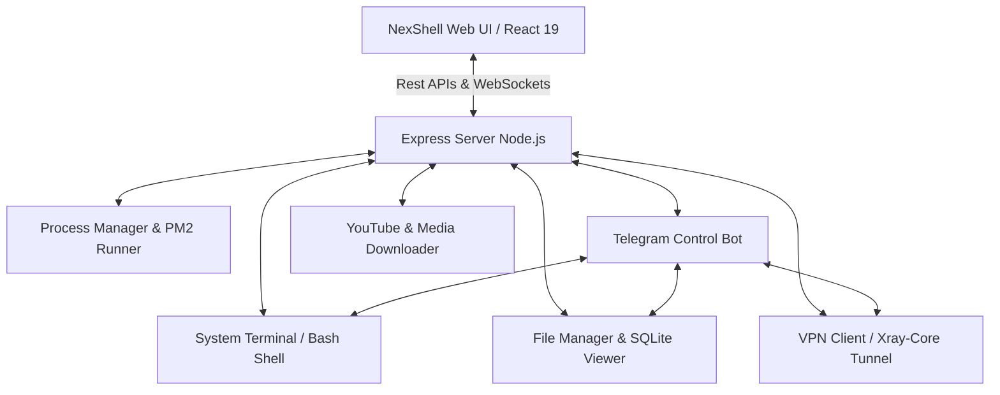

#  NexShell &mdash; ServerDash

> **Ultimate Web Terminal, Intelligent File Explorer, Integrated Telegram Bot, Background Process Runner & VPN Tunneling Suite**  
> یک پنل مدیریت وب‌سرور پیشرفته، سبک و تمام‌عیار بر پایه **Node.js (Express)** و **React (Vite + Tailwind CSS)** همراه با پایش بلادرنگ، کلاینت شبکه هوشمند (Xray/VPN)، مدیریت دیتابیس SQLite، دیپلوی خودکار از گیت‌هاب و بات تلگرام اختصاصی کنترل همه‌جانبه سرور.

<p align="center">
  
  
  
  
  
  
</p>

---

## 🗺️ نمای کلی معماری سیستم (System Architecture)



---

## ⚡ ویژگی‌های برجسته و قابلیت‌های کلیدی پنل

<div align="right" dir="rtl">

| بخش / قابلیت | توضیحات کاربردی و ویژگی‌های تعبیه‌شده | دسته‌بندی و ماژول |
| :--- | :--- | :--- |
| 🖥️ **ترمینال زنده وب (Interactive Shell)** | اجرای بلادرنگ دستورات لینوکس (Bash) با شبیه‌ساز حرفه‌ای Xterm.js، کلیدهای میانبر نظیر `Ctrl+C`, `Ctrl+A+D` (Detach) و `Ctrl+L`. | هسته اصلی |
| 🤖 **بات تلگرام یکپارچه (Telegram Bot)** | کنترل و مدیریت سرور از راه دور! اجرای دستورات، تغییر وضعیت VPN، مانیتورینگ سیستم، مدیریت فایل و دریافت هشدارهای زنده. | ماژول تلگرام |
| 📂 **مدیریت فایل و ویرایشگر کد** | ساخت، حذف، دانلود/آپلود هوشمند (Drag & Drop)، تغییر دسترسی‌ها (`chmod`) و ویرایش پیشرفته کدهای پایتون، نود و متنی. | مدیریت فایل |
| 🗄️ **نمایشگر دیتابیس SQLite** | مشاهده مستقیم جداول و داده‌های دیتابیس‌های `.db` و `.sqlite` بدون نیاز به نصب ابزارهای جانبی. | مدیریت دیتابیس |
| 📦 **عملیات گروهی فایل‌ها** | قابلیت **انتخاب چندگانه (Multi-select)** برای دانلود یا حذف گروهی فایل‌ها و پوشه‌ها با بسته‌بندی Zip. | مدیریت فایل |
| 🌐 **مدیریت هوشمند VPN** | کلاینت داخلی قدرتمند مجهز به هسته **Xray-core** با پشتیبانی از پروتکل‌های **VLESS, VMESS, Trojan, Shadowsocks, REALITY** جهت عبور ترافیک از پروکسی. | شبکه و امنیت |
| 🚀 **توسعه و به‌روزرسانی سریع (GitHub Deploy)** | کلون و دپلوی آسان پروژه‌ها از **GitHub** با نصب خودکار پیش‌نیازهای پایتون (`requirements.txt`) و نودجی‌اس (`package.json`). | ابزار توسعه |
| 🐍 **مدیریت پکیج‌های پایتون (Pip3)** | جستجو، نصب، ارتقا و حذف آسان کتابخانه‌های پایتون از طریق رابط گرافیکی بدون نیاز به دستورات ترمینال. | توسعه پایتون |
| 🎬 **دانلودر هوشمند یوتیوب (YouTube Hub)** | استخراج اطلاعات، کیفیت‌های مختلف ویدیو و صوت، با دو موتور `yt-dlp` و `pytubefix` و هدایت خودکار ترافیک از پروکسی VPN. | رسانه و دانلود |
| 📊 **پایش برخط منابع (Monitoring)** | مانیتورینگ زنده مصرف پردازنده (CPU)، حافظه (RAM)، دیسک سرور و ترافیک شبکه (RX/TX) همراه با هشدارهای مرزی. | سیستم و مانیتورینگ |
| 📱 **رابط کاربری بهینه موبایل** | طراحی ریسپانسیو و بهینه‌سازی کامل تمامی دکمه‌ها، فونت‌ها و مدال‌ها برای تجربه کاربری روان در گوشی‌های هوشمند. | تجربه کاربری |

</div>

---

## 🤖 بات تلگرام مدیریت سرور (Integrated Telegram Control Bot)

<div align="right" dir="rtl">

یکی از پیشرفته‌ترین بخش‌های پنل NexShell، **بات اختصاصی تلگرام** است که به شما امکان می‌دهد سرور لینوکس خود را بدون نیاز به ورود به وب‌سایت کنترل کنید:
* **فعال‌سازی و تنظیم آسان:** کافیست از تب اختصاصی تلگرام در پنل، `Token` بات تلگرامی و `Admin ID` خود را وارد کرده و بات را با یک کلیک روشن کنید.
* **بررسی وضعیت و تغییر پروکسی:** خاموش و روشن کردن VPN سرور (`/vpn_on`, `/vpn_off`) و بررسی وضعیت اتصال و آی‌پی فعال سیستم به صورت مستقیم از داخل تلگرام.
* **دریافت وضعیت سرور (`/status`):** مشاهده آمار لحظه‌ای مصرف رم، سی‌پی‌یو و فضای دیسک با پیام‌های گرافیکی و منظم.
* **مدیریت پردازش‌ها (`/pm2_list`):** مشاهده اسکریپت‌های در حال اجرا در پس‌زمینه و کنترل آن‌ها.

</div>

---

## 🌐 مدیریت VPN و تونلینگ سرور (Xray & Proxy Tunnel)

<div align="right" dir="rtl">

داشبورد NexShell مجهز به یک سیستم هدایت ترافیک هوشمند است:
* **پشتیبانی از پروتکل‌های مدرن:** پشتیبانی کامل از پروتکل‌های پرسرعت مانند `VLESS (REALITY / gRPC / TCP / xhttp)`، `VMess`، `Trojan` و `Shadowsocks` از طریق وارد کردن لینک‌های اشتراک یا کانفیگ تکی.
* **پروکسی‌های محلی:** سرور به صورت خودکار پورت‌های `127.0.0.1:10808` (SOCKS5) و `127.0.0.1:10809` (HTTP) را جهت استفاده اسکریپت‌های پایتون و درخواست‌های شبکه فعال می‌سازد.
* **بررسی زنده آی‌پی (IP Checker):** بررسی آدرس IP فعلی سرور و لوکیشن جغرافیایی قبل و بعد از اتصال VPN جهت اطمینان از تغییر موفق آی‌پی.

</div>

---

## 📱 بهینه‌سازی اختصاصی برای موبایل (Mobile Responsive Design)

<div align="right" dir="rtl">

تمام بخش‌های پنل به‌ویژه **بخش داکیومنت و راهنمای سیستم (Documentation)** برای نمایش روی صفحه‌نمایش‌های کوچک موبایل بهینه‌سازی شده‌اند:
* **کاهش سایز دکمه‌ها و پدینگ‌ها:** استفاده از سایزهای فشرده و بهینه (`py-1`, `px-2`, `text-[10px]`) در موبایل جهت جلوگیری از اسکرول افقی غیرضروری.
* **فیلترهای طبقه‌بندی هوشمند:** دکمه‌های فیلتر موضوعی با قابلیت اسکرول نرم افقی و دکمه باز/بستن همه‌جانبه بخش‌ها (Expand/Collapse All).
* **جستجوی آنی و سریع:** کادر جستجوی بهینه با هایلایت آنی کلیدواژه‌ها و دستورات کاربردی.

</div>

---

## 🛠️ پیش‌نیازها و بسته‌های نصب‌شده (System Stack)

پروژه برای پایداری در محیط‌های کانتینری و پشتیبانی از انواع اسکریپت‌های پردازشی به بسته‌های زیر مجهز شده است:

### 📦 بسته‌های لینوکس (`Apt-Get`):
* `python3` & `python3-pip` — جهت اجرای اسکریپت‌های پس‌زمینه و مدیریت بسته‌ها
* `ffmpeg` — برای پردازش، فشرده‌سازی و دانلود فایل‌های مالتی‌مدیا
* `proxychains4` — به منظور تونل کردن ترافیک دستورات تحت ترمینال
* `curl`, `unzip`, `tini`, `procps` — برای مانیتورینگ منابع و وظایف پایه لینوکس

### 🐍 پکیج‌های پایتون (`requirements.txt`):
* **دانلودرها و هوش رسانه‌ای:** `yt-dlp` | `gallery-dl` | `streamlink` | `instagrapi`
* **ابزارهای شبکه و سیستم:** `psutil` | `requests` | `aiohttp` | `aiofiles` | `beautifulsoup4`

---

## 🚀 راهنمای راه‌اندازی محلی (Local Setup)

### ۱. دریافت و نصب وابستگی‌های پروژه
کتابخانه‌های فرانت‌اند و بک‌اند پروژه را نصب کرده و پکیج‌های پایتون را مستقر کنید:
```bash
# نصب پکیج‌های بخش Node.js
npm install

# نصب پیش‌نیازهای ابزارهای سیستم
pip install -r requirements.txt --break-system-packages
```

### ۲. اجرای پروژه در حالت توسعه (Development Mode)
```bash
npm run dev
```
داشبورد روی پورت تعیین شده به آدرس `http://localhost:3000` در دسترس شما قرار می‌گیرد.

### ۳. ساخت بیلد نهایی و اجرا در محیط عملیاتی (Production Build)
```bash
npm run build
npm start
```

---

## 🔐 احراز هویت امن و راه‌اندازی اولیه بدون رمز پیش‌فرض

جهت ارتقای حداکثری امنیت سرور و جلوگیری از حملات نفوذ، **هیچ‌گونه رمز عبور یا نام کاربری پیش‌فرض آسیب‌پذیری در سامانه وجود ندارد**:

* **اولین ورود به سیستم (Initial Setup):** به محض باز کردن پنل وب برای اولین بار، مستقیماً به صفحه راه‌اندازی و **تعیین اجباری رمز عبور مدیر** هدایت می‌شوید.
* **ثبت مشخصات:** نام کاربری دلخواه (پیش‌فرض `admin`) و رمز عبور امن اختصاصی خود را وارد کرده و با یک کلیک وارد پنل می‌شوید.
* **تغییر مشخصات در آینده:** در هر زمان می‌توانید با کلیک بر روی **آیکون سپر (تنظیمات امنیتی)** در نوار بالای پنل، رمز عبور یا نام کاربری خود را بروزرسانی نمایید.

---

## 📂 ساختار کدهای برنامه (Project Architecture)

```text
├── server.ts                  # سرور قدرتمند Express مجهز به وب‌سوکت‌ها و APIهای کنترلی
├── telegram_bot/              # دایرکتوری کنترل اتصالات VPN و هسته کلاینت تلگرام
│   ├── telegram_bot.py        # بات تلگرام اختصاصی مدیریت همه‌جانبه سیستم و سرور
│   ├── vpn_manager.py         # موتور کنترل اتصالات Xray-Core و ثبت وضعیت فعال
│   ├── file_manager.py        # فایل منیجر داخلی سیستم تلگرام
│   └── vpn_cli.py             # واسط خط فرمان VPN جهت تعامل محلی با هسته Xray
├── src/
│   ├── App.tsx                # کامپوننت پایه فرانت‌اند، مسیریابی و کنترل دسترسی‌ها
│   ├── components/
│   │   ├── TerminalView.tsx   # واسط گرافیکی ترمینال با کلیدهای سریع و شبیه‌ساز زنده
│   │   ├── FileManager.tsx    # ماژول مدیریت فایل و نمایشگر دیتابیس SQLite
│   │   ├── ProcessManager.tsx # سیستم مانیتور، اجرا و مدیریت PM2 و پکیج‌های Pip
│   │   ├── TelegramBotManager.tsx # پنل پیکربندی، روشن/خاموش کردن و پایش بات تلگرام
│   │   ├── YouTubeManager.tsx  # پنل استخراج و دانلود ویدیوهای یوتیوب با yt-dlp
│   │   ├── DocumentationView.tsx # بخش جامع داکیومنت و راهنمای برنامه بهینه برای موبایل
│   │   ├── DocumentationModal.tsx # مدال سریع داکیومنت همراه با کلیدهای میانبر F1 و Shift+?
│   │   └── LogsViewer.tsx     # فیلترینگ و مشاهده پیشرفته لاگ‌های سیستمی لینوکس
│   └── locales/
│       └── translations.ts    # بومی‌سازی کامل پنل به زبان فارسی و انگلیسی
├── nixpacks.toml              # کانفیگ خودکار دپلوی روی پلتفرم‌های کانتینری
└── Dockerfile                 # کانتینر داکر بهینه برای اجرای ابزارهای شبکه و سیستم
```

---

## ⚖️ لایسنس (License)

این پروژه تحت قوانین لایسنس بین‌المللی **MIT** منتشر شده است و برای هر نوع توسعه تجاری یا شخصی آزاد و رایگان است.
